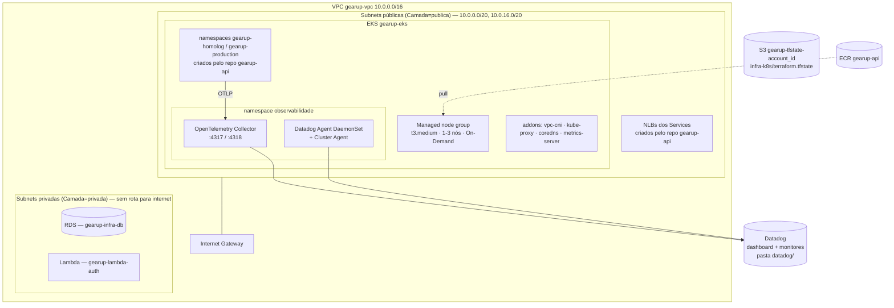

# gearup-infra-k8s

Infraestrutura Kubernetes da plataforma **GearUp** (Tech Challenge FIAP — Fase 3), provisionada com Terraform na AWS (AWS Academy Learner Lab).

## Propósito

Criar e manter a base compartilhada onde a API roda e é observada:

- **Rede:** VPC `10.0.0.0/16`, 2 subnets públicas (nós e Load Balancers) e 2 privadas (RDS e Lambda), em 2 AZs, **sem NAT Gateway**.
- **Cluster EKS** `gearup-eks` com managed node group (t3.medium, 1–3 nós, On-Demand) e addons `vpc-cni`, `kube-proxy`, `coredns` e `metrics-server` (pré-requisito do HPA).
- **ECR** `gearup-api` com tags imutáveis e scan on push.
- **Observabilidade:** OpenTelemetry Collector e Datadog Agent (Helm) no namespace `observabilidade`.
- **Datadog como código** (pasta `datadog/`): dashboard "GearUp - Operação" e monitores.

Faz parte de uma plataforma de 4 repositórios:

| Repositório | Papel |
|---|---|
| **gearup-infra-k8s** (este) | rede, cluster, registro de imagens, observabilidade |
| [gearup-infra-db](https://github.com/SOAT-GearUp/gearup-infra-db) | RDS PostgreSQL (usa a VPC deste repo) |
| [gearup-api](https://github.com/SOAT-GearUp/gearup-api) | API, deploy no cluster, documentação arquitetural |
| [gearup-lambda-auth](https://github.com/SOAT-GearUp/gearup-lambda-auth) | Lambda de autenticação (CPF e senha) e API Gateway |

## Arquitetura



## Tecnologias

Terraform ≥ 1.10 (providers `aws` 6.x, `helm` 3.x, `kubernetes` 2.x, `DataDog/datadog` 3.x) · Amazon EKS · Amazon ECR · Helm (charts `open-telemetry/opentelemetry-collector` e `datadog/datadog`) · GitHub Actions · state em S3 com lock nativo.

## Restrições do Learner Lab respeitadas

- **Nenhum recurso IAM é criado.** As roles `LabEksClusterRole`/`LabEksNodeRole` são descobertas por regex, com fallback para `LabRole` (`terraform/data.tf`). Por isso não usamos o módulo `terraform-aws-modules/eks`.
- Região fixa `us-east-1`; instâncias limitadas a `nano..large` e no máximo 4 nós (validações nas variáveis); somente On-Demand.
- Versão do Kubernetes não fixada (evita *extended support*, 6× mais caro).
- Sem NAT Gateway: ver [ADR-005](https://github.com/SOAT-GearUp/gearup-api/blob/master/docs/fase-3/ADR/ADR-005%20-%20Rede%20sem%20NAT%20Gateway.md).

## CI/CD

Workflow [`terraform.yml`](.github/workflows/terraform.yml):

| Evento | O que roda | Ambiente GitHub |
|---|---|---|
| Pull Request | `fmt -check`, `validate` (cluster e Datadog), `plan` | homolog |
| push `homolog` | idem + `plan` contra a conta real | homolog |
| push `main` (só via PR) | `apply` do cluster + `apply` do Datadog (se houver `DATADOG_APP_KEY`) | production |
| Run workflow → `destroy` | remove namespaces da aplicação (NLBs) e faz `destroy` | production |

O cluster é compartilhado pelos ambientes da aplicação (namespaces), por isso `homolog` valida com `plan` e só `main` aplica — decisão de custo na [RFC-001](https://github.com/SOAT-GearUp/gearup-api/blob/master/docs/fase-3/RFC/RFC-001%20-%20Nuvem%20e%20estrategia%20de%20ambientes.md).

**Secrets** (Settings → Secrets and variables → Actions):

| Secret | Obrigatório | Origem |
|---|---|---|
| `AWS_ACCESS_KEY_ID`, `AWS_SECRET_ACCESS_KEY`, `AWS_SESSION_TOKEN` | sim | Learner Lab → AWS Details → AWS CLI (expiram a cada sessão; use `scripts/atualizar-secrets-aws.ps1` do repo gearup-api) |
| `DATADOG_API_KEY` | não | Datadog → Organization Settings → API Keys. Sem ele, o Collector usa o exporter `debug` e o Agent não é instalado |
| `DATADOG_APP_KEY` | não | Datadog → Application Keys. Necessário apenas para dashboards e monitores |

## Execução local

Windows PowerShell 5.1, com as credenciais do lab em `%USERPROFILE%\.aws\credentials`:

```powershell
.\scripts\tf-init.ps1                          # cria o bucket de state se preciso e roda terraform init
$env:TF_VAR_datadog_api_key = "<api key>"      # opcional
terraform -chdir=terraform plan
terraform -chdir=terraform apply               # ~15 min
aws eks update-kubeconfig --region us-east-1 --name gearup-eks
kubectl get nodes
kubectl get pods -n observabilidade

# Dashboards e monitores (opcional)
$env:DD_API_KEY = "<api key>"; $env:DD_APP_KEY = "<app key>"
.\scripts\tf-init.ps1 -Diretorio datadog
terraform -chdir=datadog apply
```

Em bash: `bash scripts/tf-init.sh terraform` e `bash scripts/tf-init.sh datadog`.

### Saídas úteis

| Output | Uso |
|---|---|
| `comando_kubeconfig` | configurar o `kubectl` |
| `repositorio_ecr` | destino do `docker push` da pipeline do gearup-api |
| `endpoint_otlp` | `OTEL_EXPORTER_OTLP_ENDPOINT` da API |
| `url_dashboard` (pasta `datadog/`) | link do dashboard |

## Destroy (fim de cada sessão)

Este é o **último** repositório a ser destruído (a VPC é usada pelos outros). Ordem: `gearup-lambda-auth` → `gearup-api` → `gearup-infra-db` → **gearup-infra-k8s**. Detalhes no [Guia de Operação](https://github.com/SOAT-GearUp/gearup-api/blob/master/docs/fase-3/Operacao/Guia%20de%20Deploy%20e%20Operacao.md).

```powershell
terraform -chdir=terraform destroy
```

## Custos

| Recurso | US$/h |
|---|---|
| EKS control plane | 0,100 (24/7, inclusive com o lab parado) |
| 2 × t3.medium | 0,083 |
| ECR, S3 do state | centavos/mês |

## Swagger / Postman

Este repositório não expõe APIs. O Swagger da aplicação e as collections Postman estão no [gearup-api](https://github.com/SOAT-GearUp/gearup-api#apis-swagger-e-postman).
